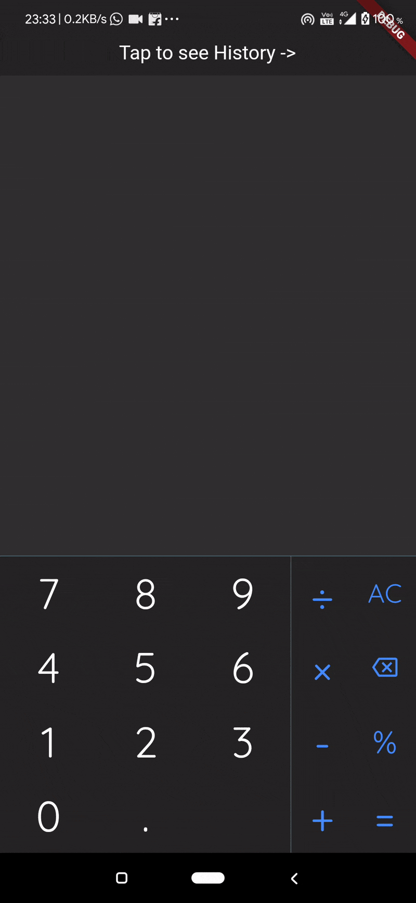

# calculator

A new Flutter project.

## Getting Started

This is a simple calculator with backspace, clear and basic functionality .
It also has a history feature
You cannot add more than one operator at a time.

## Demo

